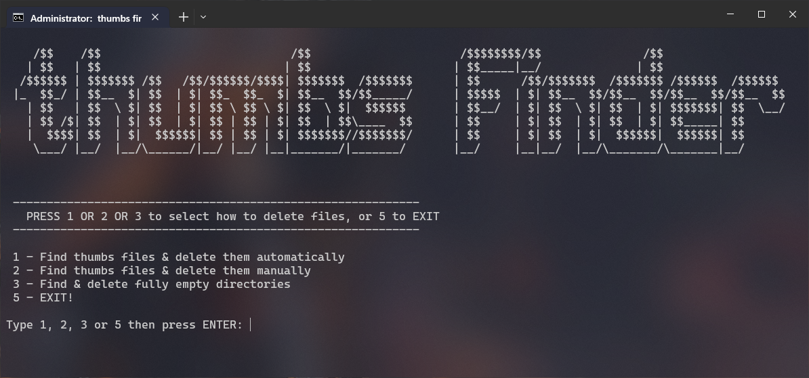

# ThumbsFinder

In old Windows, thumb files are found many times, which take up a lot of hard drive and make it difficult to copy and cut folders. Also, these files may be infected!\
You can use this program to identify and clean your computer from thumb files.

## Features

1. Finding all thumbs in the specified path (folders and subfolders)
2. Automatic permanent cleanup as soon as found
3. Manual cleaning to check each one of them
4. Clean up empty folders

> Sometimes the contents of a folder is just a thumbnail file! This is where option 4 comes in handy if you don't need empty folders.

## Screenshot

